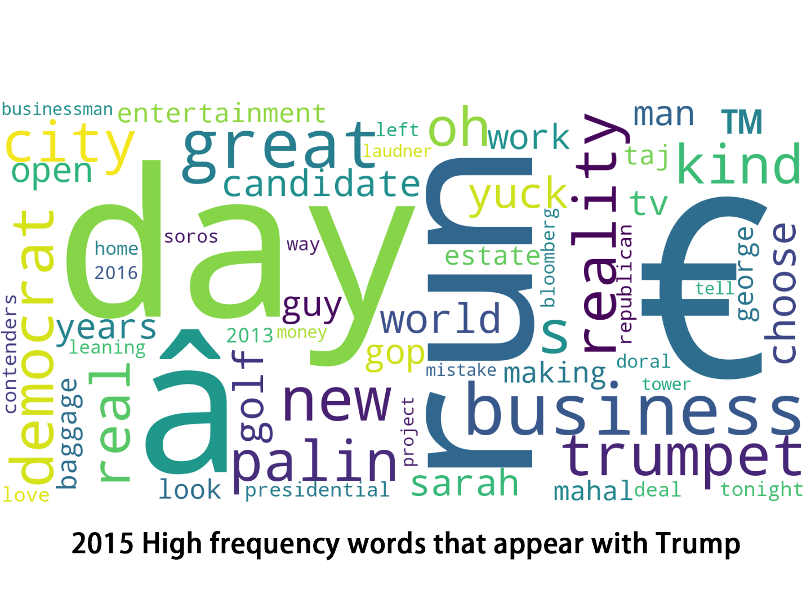

## Backgrounds 

In recent years, Donald Trump is no doubt one of the most
controversial public figures around the world. From winning the 2016
presidential election as a dark horse to losing the election by a
narrow margin in late 2020, Trump has made a significant impact on
the United States and the world during the four years of his presidency.

In our story we are going to discover what has changed for quotes on Trump and the reason behind these changes. At the beginning, we will first discover the change of Trump's social circle by analysing who talked most about him at different times. Then we are going to investigate the changes over people's words when they talked about Trump. After that, we go one step further to analyse the semantics of quotes rather than analysing on the level of words. Finally, we will try to identify the potential factors that would have caused these changes.

## Who talked most about Trump?

### Who talked most about Trump in 2015 before election?
<iframe frameborder="no" border="0" marginwidth="0" marginheight="0" width="100%" height="500" allowfullscreen="true" src="assets/img/quotes-2015_top10_count.html"></iframe>

Trump has announced his willingness for the presidential election in June 2015. Before his presidency,  as we know, he was a businessman, a TV show host, a writer of *The art of the deal*, a WWE wrestler,with such a rich professional experience but surprisingly no political career.  It would be interesting to see who talks most about Trump at different times. Since this may reveal how his social circle changes. Thanks to quotebank, we collect all those people who talked most about Trump before he announced his candidacy.  As shown in the above picture, Trump himself without doubt has most quotations about himself. Other people seem to be less famous. Their occupations are shown in the table below. 

<figure class="sidenote">
    
    <figcaption><em>Figure 1.</em> Trump and his wings</figcaption>
</figure>

| People              | Occupation                 |
| :-------------------| ---------------------------|
| Sarah Palin         | a local politician         |
|  Herman Saatkamp    | fourth president of Stockton University  |
| Jerry Seinfeld      | a famous actor             |
| Steve Deace         | a comedy show host         |
| Alec Baldwinn       | an actor                   |
| Ian Ziering         | an actor                   |
| John Gibbons        | a baseball player          |
| Hope Hicks          | a  former employee of The Trump Organization |
| Leeza Gibbons       | a talk show host           |
| Joe Scarborough     | a Television host          |

As we can see from the table, most people are non politicians and most of them are from show business. If we take a close look at the quotation numbers, we found that they are all less than one hundred. Not too many people were interested in Trump except himself before his presidency.  However everything has changed after he became president of america. Now let us fly to 2020 to see who talks about him most. As shown in the picture below, first and not surprisingly, Trump was still the person who talked himself most. However, other people who talked most about Trump have hugely changed. One obvious observation is that all of them are now politicians. This strongly suggests that Trump’s circle has changed, from a businessman to the centre of the political vortex. On the other hand, if we take a close look at the quotation numbers, we may find that it has grown hugely from below a hundred to thousands of quotes. This also suggests that Trump becomes the centre of the whirling vortex of politics. 

### Who talked most about Trump in 2020?
<iframe frameborder="no" border="0" marginwidth="0" marginheight="0" width="100%" height="500" allowfullscreen="true" src="assets/img/quotes-2020_top10_count.html"></iframe>

In this part we have discovered the transition of Trump’s circle from the difference of people who talked about him most. It would be nice to take a closer look at what people actually say. So we analyze the word frequency as discussed in the next section.

## **Word frequency** 

<figure style="text-align: center">
    
</figure>

Now let us look at the keywords of all quotes in 2015 before he announced his candidacy. As shown in the above picture, we can see some interesting keywords such as “business”, “businessman”, “golf” etc. This matches his role at that time pretty well. Now let us fly to 2020, as shown in the second picture here we can easily see that the semantics of  keywords have hugely changed. Most keywords appearing now are tightly related to topics of politics, such as “campaign”, “administration”, “election“ etc. Again, this gives us strong evidence of the transition of Trump’s position, namely from  a businessman to the president. Also not surprisingly, we found the keywords “coronavirus”  in the below  picture which also made us more convinced that  this “word cloud” in some way can represent the trends of that time.

<figure style="text-align: center">
    
</figure>

In this section  we have checked word frequency to analyse how Trump’s role changed and how main topics have changed when people speak about Trump. However, in this section we did not analyse the semantics on the level of the sentence.  It would be nice to discover the semantics of each quote. So in the next section we will use BERT to do further  analysis.

## The Semantics of the Quotes in 2015 are Different

<iframe frameborder="no" border="0" marginwidth="0" marginheight="0" width="100%" height="500" allowfullscreen="true" src="assets/img/PCA_Result_of_Aggrageted_by_Month.html"></iframe>

The graph above is the 2-dimension representation of the word
embeddings aggregated by months. We aggregate the word embeddings by
averaging the embedding vectors grouped by months. In the graph,
numbers called 'Date Sequence' map to months between January 2015 and
April 2020.

As we can see from the graph, quotes in 2015, which are represented by
points with the darkest colours, have vastly different semantics from
those in the other years. These points are mostly around (0.6, 0) and
in the graph they are to the right of where most other points
lie. Also, some spread around the graph.

2015 is the year preceding Trump's presidency and as we can see from
our previous analysis people who talked about Trump has changed after
his presidency, which should be the main reason why quotes in 2015
mentioning Trump have different semantics.

If the conjecture were true, we can see that different people talk in
different styles and talk about different things and one of the most
significant change takes place around 2015, which is about the time
when Trump turned from a businessman without political experience into
the president of the United States. Below, we will dig deeper to find
out the factors that may influence people's words towards Trump.

## Cluster Analysis

Having viewed the results grouped by the nationalities and age groups,
we observed that there are people from different regions have
different attitudes towards Trump; however, different age groups does
not give the same result. In this case, we want to have a higher and
more abstract view of how different kinds of people have different
views or speak differently about Trump. We decided to do the
clustering based on speakers’ age, nationalities, genders, religions,
parties, and their education degrees. Data from Wikidata have too many
low level details and concepts. It is hard to analyse the data in its
raw form because the raw data bring in too many categorical values
that makes clustering analysis infeasible. Therefore, we make use of
the semantic links in the Wikidata database so that we can work on
fewer concepts that have broader semantics.

For clustering, we used K-prototype, which could deal with mixed data
continue variables and categorical variables. After getting the costs
tendency (see below), we decided to cluster speakers into 5
clusters.

<!-- Costs -->
<iframe frameborder="no" border="0" marginwidth="0" marginheight="0"
width="100%" height="500" allowfullscreen="true"
src="assets/img/Costs_Trendency_depending_on_the_Number_of_Clusters.html"></iframe>

<!-- PCA Plots of Clustering -->
<iframe frameborder="no" border="0" marginwidth="0" marginheight="0"
width="100%" height="500" allowfullscreen="true"
src="assets/img/PCA_Result_of_Clustering.html"></iframe>

The figures show the distribution of features for each
cluster as below.

<!-- Age Distribution -->
<iframe frameborder="no" border="0" marginwidth="0" marginheight="0"
width="100%" height="500" allowfullscreen="true"
src="assets/img/Age_Distribution_over_Clusters.html"></iframe>

<!-- Candidate Portion -->
<iframe frameborder="no" border="0" marginwidth="0" marginheight="0"
width="100%" height="500" allowfullscreen="true"
src="assets/img/Candidate_Portion_in_cluster.html"></iframe>

<!-- Education Portion -->
<iframe frameborder="no" border="0" marginwidth="0" marginheight="0"
width="100%" height="500" allowfullscreen="true"
src="assets/img/Education_Portion_in_cluster.html"></iframe>

<!-- Gender Portion -->
<iframe frameborder="no" border="0" marginwidth="0" marginheight="0"
width="100%" height="500" allowfullscreen="true"
src="assets/img/Gender_portion_in_cluster.html"></iframe>

<!-- Party Portion -->
<iframe frameborder="no" border="0" marginwidth="0" marginheight="0"
width="100%" height="500" allowfullscreen="true"
src="assets/img/Party_Portion_in_cluster.html"></iframe>

<!-- Regions Portion -->
<iframe frameborder="no" border="0" marginwidth="0" marginheight="0"
width="100%" height="500" allowfullscreen="true"
src="assets/img/Regions_Portion_in_cluster.html"></iframe>

<!-- Religion Portion -->
<iframe frameborder="no" border="0" marginwidth="0" marginheight="0"
width="100%" height="500" allowfullscreen="true"
src="assets/img/Religion_Portion_in_cluster.html"></iframe>

Then, we want to see if there exists different quotes’ contents over
different cluster. We first calculated mean of each cluster for each
month based on BERT embedding matrix. And then we did 2-dimention PCA
for all of the mean vector.

<!-- All Speakers -->
<iframe frameborder="no" border="0" marginwidth="0" marginheight="0"
width="100%" height="500" allowfullscreen="true"
src="assets/img/Total_Speakers_Time_PCA_Result.html"></iframe>

From the above figure, we could observe that although different
clusters had different quotes’ contents’ in early years (i.e. 2015,
2016), then, as time passed, all the clusters’ quotes’ contents tend
to be the same. This result also implies that people tend to talked
about Trump under a focused context after he became
president. Combined with the word cloud we have above, we could see
that the contexts focused more on the political aspects.

<iframe frameborder="no" border="0" marginwidth="0" marginheight="0"
allowfullscreen="true"
src="assets/img/distribution_of_speakers_Regions_2019.html"></iframe>
